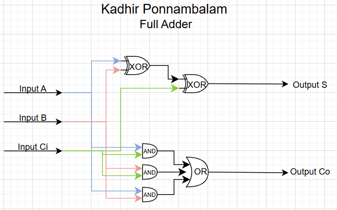
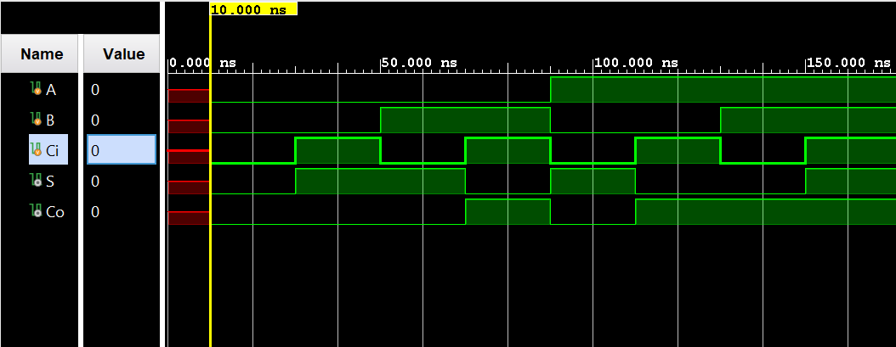

# Full Adder

A Verilog implementation of a full adder, developed in Vivado IDE. This document provides theory, derivations, and simulation results for the circuit.

---

## Table of Contents

- [What Is a Full Adder?](#what-is-a-full-adder)
- [Learning Resources](#learning-resources)
- [Truth Table](#truth-table)
- [K-Maps](#k-maps)
- [Simplified Boolean Equations](#simplified-boolean-equations)
- [Circuit Diagram](#circuit-diagram)
- [Waveform Diagram](#waveform-diagram)
- [Testbench Output](#testbench-output)
- [Running the Project in Vivado](#running-the-project-in-vivado)
- [Project Files](#project-files)

---

## What Is a Full Adder?

A **full adder** is a combinational circuit that adds three single binary bits and produces two outputs: a **sum** (**S**) and a **carry-out** (**Co**). Unlike a half adder, it has a **carry-in** (**Ci**) input, so it can be chained to form multi-bit adders (e.g. ripple-carry adders) used in CPUs, ALUs, and digital arithmetic units.

- **Inputs:** Three bits **A**, **B**, and **Ci** (the two bits to be added plus the carry from the previous stage).
- **Outputs:**
  - **S** (sum): the least significant bit of A + B + Ci.
  - **Co** (carry-out): the carry out when A + B + Ci ≥ 2 (1 when two or more of A, B, Ci are 1).

So the full adder performs one-column binary addition with carry-in and carry-out. The sum bit **S** is the XOR of **A**, **B**, and **Ci**; the carry-out **Co** is 1 when at least two of A, B, and Ci are 1 (i.e. **Co = AB + ACi + BCi**). Full adders are the standard building block for multi-bit binary addition.

---

## Learning Resources

Useful online resources for full adders and digital design:

| Resource | Description |
|----------|-------------|
| [Full Adder (YouTube)](https://www.youtube.com/results?search_query=full+adder) | Search for “full adder” for step-by-step explanations and truth tables. |
| [Full Adder Verilog (YouTube)](https://www.youtube.com/results?search_query=full+adder+verilog) | Search for “full adder Verilog” for RTL and testbench examples. |
| [K-Map Simplification (YouTube)](https://www.youtube.com/results?search_query=karnaugh+map+simplification) | Search for “Karnaugh map simplification” to see how sum and carry-out equations are derived. |
| [Ripple Carry Adder (YouTube)](https://www.youtube.com/results?search_query=ripple+carry+adder) | Search for “ripple carry adder” to see how full adders are chained for multi-bit addition. |

---

## Truth Table

The full adder has three inputs (**A**, **B**, **Ci**) and two outputs (**S**, **Co**). The table below lists all eight input combinations and the corresponding sum and carry-out.

| **A** | **B** | **Ci** | **‖** | **S** | **Co** |
|:-----:|:-----:|:------:|:-----:|:-----:|:------:|
| **———** | **———** | **———** | **———** | **———** | **———** |
| 0 | 0 | 0 | **\|** | 0 | 0 |
| 0 | 0 | 1 | **\|** | 1 | 0 |
| 0 | 1 | 0 | **\|** | 1 | 0 |
| 0 | 1 | 1 | **\|** | 0 | 1 |
| 1 | 0 | 0 | **\|** | 1 | 0 |
| 1 | 0 | 1 | **\|** | 0 | 1 |
| 1 | 1 | 0 | **\|** | 0 | 1 |
| 1 | 1 | 1 | **\|** | 1 | 1 |

---

## K-Maps

Karnaugh maps for the two outputs **S** and **Co** in terms of **A**, **B**, and **Ci**. Rows are **A**, columns are **B Ci** (in Gray-code order 00, 01, 11, 10).

### Sum (S)

| **A \ B Ci** | **00** | **01** | **11** | **10** |
|:------------:|:-----:|:------:|:------:|:------:|
| **0** | 0 | 1 | 0 | 1 |
| **1** | 1 | 0 | 1 | 0 |

**Observation:** **S** is 1 when an odd number of A, B, and Ci are 1. The four 1s do not form a single product term; the minimal expression is the XOR of all three inputs.

From the four groups of 1s:

$$S = AB'C_i' + A'B'C_i + ABC_i + A'BC_i'$$

$$Let \(X = B \oplus C_i\), so \(X' = B \odot C_i\) (XNOR). Then:$$

$$S = A \cdot X' + A' \cdot X = A \oplus X$$

Hence:

$$S = A \oplus B \oplus C_i$$

---

### Carry-out (Co)

| **A \ B Ci** | **00** | **01** | **11** | **10** |
|:------------:|:-----:|:------:|:------:|:------:|
| **0** | 0 | 0 | 1 | 0 |
| **1** | 0 | 1 | 1 | 1 |

**Observation:** **Co** is 1 when at least two of A, B, and Ci are 1. Three groups of two 1s give:

$$C_o = AC_i + BC_i + AB$$

---

## Simplified Boolean Equations

Summary of the simplified expressions used in the Verilog RTL (⊕ = XOR, · = AND, + = OR):

**Sum:**

$$S = A \oplus B \oplus C_i$$

**Carry-out:**

$$C_o = AB + AC_i + BC_i$$

In Verilog, these are implemented as `assign S = A ^ B ^ Ci;` and `assign Co = A&B | A&Ci | B&Ci;` respectively.

---

## Circuit Diagram



*Circuit diagram: full adder with inputs A, B, Ci and outputs S (sum) and Co (carry-out), typically using two XOR gates, two AND gates, and one OR gate (or equivalent).*

---

## Waveform Diagram

Simulation waveform for the full adder. Inputs **A**, **B**, and **Ci** cycle through all eight combinations; outputs **S** and **Co** follow the truth table.



*Waveform: inputs A, B, Ci and outputs S (sum), Co (carry-out).*

---

## Testbench Output

Terminal output from the testbench for all eight input combinations (A, B, Ci):

```
 A=0, B=0, Ci=0, S=0, Co=0 

 A=0, B=0, Ci=1, S=1, Co=0 

 A=0, B=1, Ci=0, S=1, Co=0 

 A=0, B=1, Ci=1, S=0, Co=1 

 A=1, B=0, Ci=0, S=1, Co=0 

 A=1, B=0, Ci=1, S=0, Co=1 

 A=1, B=1, Ci=0, S=0, Co=1 

 A=1, B=1, Ci=1, S=1, Co=1 
```

These results match the truth table and confirm that the full adder produces the correct sum and carry-out for each (A, B, Ci) combination.

---

## Running the Project in Vivado

Follow these steps to open the project in **Vivado** and run simulation.

### Prerequisites

- **Xilinx Vivado** installed (Vivado HL Design Edition or Lab Edition; any recent version that supports your OS).

### 1. Launch Vivado

Start Vivado from the Start Menu (Windows) or your application launcher. Choose **Vivado HLx** (or **Vivado**).

### 2. Create a New Project

1. Click **Create Project** (or **File → Project → New**).
2. Click **Next** on the welcome page.
3. Choose **RTL Project** and leave **Do not specify sources at this time** unchecked if you want to add sources in the next step, or check it and add sources later. Click **Next**.
4. Add design and simulation sources:
   - Click **Add Sources** → **Add or create design sources** → **Add Files** and add `fulladder.v`.
   - Click **Add Sources** → **Add or create simulation sources** → **Add Files** and add `fulladder_tb.v`.
   - Ensure the testbench is set as the **top** for simulation (right‑click `fulladder_tb.v` in the Sources window → **Set as Top** for simulation).
5. Click **Next**, select your **target device** (e.g. a default FPGA/part or “Don’t specify” for simulation-only), then **Next** → **Finish**.

### 3. Run Behavioral Simulation

1. In the **Flow Navigator** (left panel), under **Simulation**, click **Run Behavioral Simulation**.
2. Vivado will compile the design and testbench and open the **Simulation** view with the waveform.
3. Use the waveform to verify that inputs A, B, Ci and outputs S, Co match the [truth table](#truth-table) and [testbench output](#testbench-output) above.

### 4. (Optional) Re-run or Reload

- To re-run: **Flow Navigator → Simulation → Run Behavioral Simulation** (or use the re-run button in the simulation toolbar).
- To change the testbench or RTL, edit the `.v` files, save, then run simulation again.

### 5. (Optional) Synthesis and Implementation

If you want to target real hardware:

1. Set `fulladder` as the top module: in **Sources**, right‑click `fulladder.v` → **Set as Top**.
2. Run **Synthesis** from the Flow Navigator, then **Implementation**, then **Generate Bitstream** (after assigning pins in a constraints file if required).

---

## Project Files

- `fulladder.v` — RTL for the full adder (inputs A, B, Ci; outputs S, Co)
- `fulladder_tb.v` — Testbench

*Author: Kadhir Ponnambalam*
